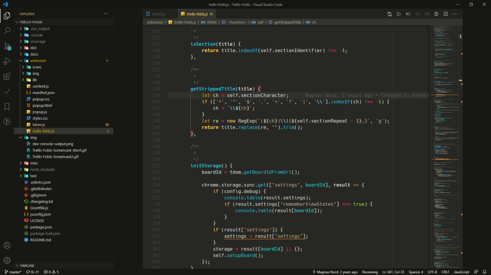

# AGNIS Theme

A theme from up north, created A Gloomy Night In Sweden (AGNIS).

**Enjoy!**

## Changelog

[CHANGELOG.md](https://code.visualstudio.com/)

## Contributing

Found something weird? Please report [here](). Please provide a screenshot for
clarification purposes is possible.

[GitHub repository](https://github.com/NordMagnus/AGNIS)

## Installation

1. Install [Visual Studio Code](https://code.visualstudio.com/)
2. Launch Visual Studio Code
3. Choose **Extensions** from menu
4. Search for `vscode-theme-ageis`
5. Click **Install** to install it
6. Click **Reload** to reload the Code
7. File > Preferences > Color Theme > **Cobalt2**

## Screenshots

### JavaScript and Hack Mono

### Markdown

TBD

### TypeScript and Victor Mono

TBD

### Docker File and Fira Code

TBD
