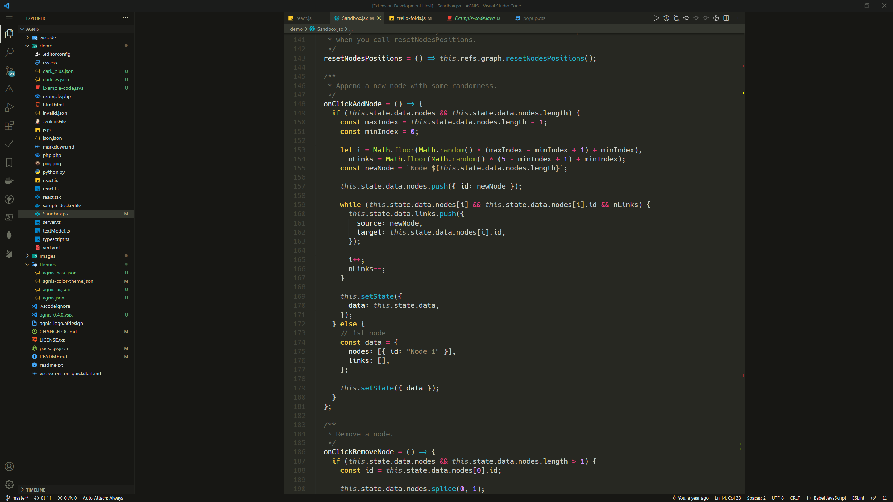
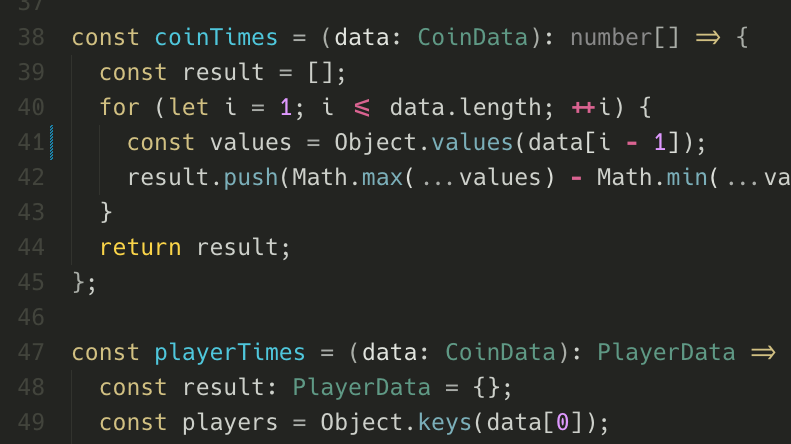
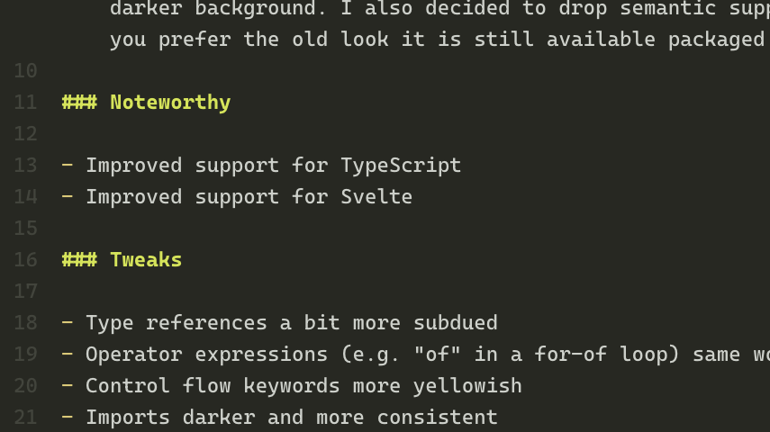

# AGNIS Theme

A theme from up north, created A Gloomy Night In Sweden (AGNIS).

**Enjoy!**

## Changelog

[CHANGELOG.md](./CHANGELOG.md)

## Contributing

Found something weird? Please report [here](). Please provide a screenshot for
clarification purposes if possible.

[GitHub repository](https://github.com/NordMagnus/AGNIS)

## Installation

1. Install [Visual Studio Code](https://code.visualstudio.com/)
2. Launch Visual Studio Code
3. Choose **Extensions** from menu
4. Search for `AGNIS`
5. Click **Install** to install it
6. Click **Reload** to reload the Code
7. File > Preferences > Color Theme > **AGNIS**

## About bracket pair highlighting

Not a big fan, so the theme setup is pretty toned down. You can override
and customize it in VS Code settings yourself using the settings below.

    {
      "editor.bracketPairColorization.enabled": true,
      "workbench.colorCustomizations": {
        "editorBracketHighlight.foreground1": "#CDD0CA",
        "editorBracketHighlight.foreground2": "#CDD0CA",
        "editorBracketHighlight.foreground3": "#CDD0CA",
        "editorBracketHighlight.foreground4": "#d4e448",
        "editorBracketHighlight.foreground5": "#f6d256",
        "editorBracketHighlight.foreground6": "#df99ff",
        "editorBracketHighlight.unexpectedBracket.foreground": "#ff0000"
      },
    }    

## Screenshots

### JavaScript with Hack Mono

### Markdown with Hack Mono

